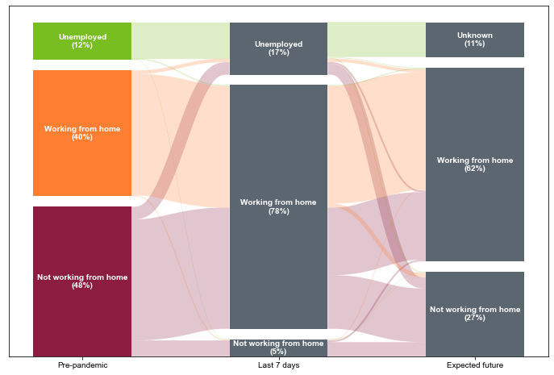

# Time-series Sankey

This library creates modified [Sankey plots](https://en.wikipedia.org/wiki/Sankey_diagram), of the type shown in Figure 3 of [Conway, Salon, Capasso da Silva, and Mirtich 2020](https://doi.org/10.3390/urbansci4040050), reproduced below.

_Image &copy; Matthew Wigginton Conway, Deborah Salon, Denise Capasso da Silva, and Laura Mirtich, 2020, CC-BY._

They are _modified_ Sankey plots because, when there are more than two time periods (as in the plot above), the colors allow the reader to trace a single individual from the first time period all the way to the last. For instance, the plot above indicates that about half of the people who were not working from home before the COVID-19 pandemic and were during the pandemic expect to work from home after the pandemic.

There's only one function in the module: `tssankey`. Options are documented below.

df: pd.DataFrame 
>    A dataframe with one categorical column per time period and one row per observation to show how individuals transition between the categories. Categories do not need to be the same in all columns.
bar_width: float
>    The width of the bars, with 1.0 indicating they touch and have no space for the Sankey lines between them. Default 0.4.
figsize: tuple
>    Size of the figure to plot, as a tuple (x, y). Default (12, 8).
total_gap: float
>    The total vertical gap between all categories in a period. Scale is number of observations. For instance, a value of 100 with five categories will mean that there will be a space equivalent to 25 observations between each category and the next. Default 100.
ax: axes
>    axes to plot on. Figsize ignored if specified. Default is to create new axes.
weights: pd.Series
>    weights for each observation, parallel to df. Default no weights.
colors: dict
>    Map from category names to colors to use for that category. Default is to use colors from the matplotlib style.
curve_color: function
>    Function that receives first category, left category, and right category for a curve, and returns a color. Default to use the colors of the first category, as specified by colors or in the style.
percent_labels: bool
>    If True, label each category with the percent of the total represented by that category.

This software was written with support from the National Science Foundation, the Center for Teaching Old Models New Tricks at Arizona State University, and the CONVERGE initiave at CU Boulder.
